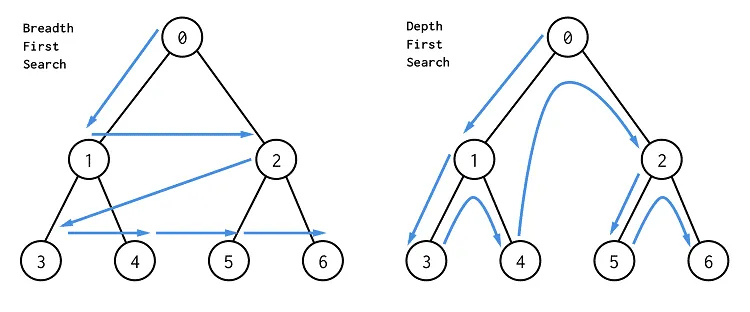

> 해를 찾는 도중 해가 절대 될 수 없다고 판단되면, 되돌아가서 해를 다시 찾아가는 기법
최적화 문제와 결정 문제를 푸는 방법이 된다.
> 

# 12-1 백트래킹과 백트래킹 알고리즘 개념

## 백트래킹이란?

예를 들어, 출근하기 위해 아파트를 나섰는데 지하철 개찰구에 도착해서야 지갑을 두고 나온 사실을 알았다고 가정하자. 그러면 우선 아파트로 돌아갈 것이다. 집으로 가 방을 하나씩 보면서 물건을 찾을 것이다. 혹시라도 옆 집의 문 앞에 선 경우라도 금방 우리집이 아니라는 생각으로 뒤로 돌아 우리 집으로 향할 것이다.

이렇듯 **어떤 가능성이 없는 곳을 알아보고 되돌아가는 것을 백트래킹(Backtracking)이라고 한다.**

## 백트래킹 알고리즘이란?

답을 찾는 과정에서 가능성이 없는 곳에서는 백트래킹한다.

백트래킹 알고리즘은 문제마다 효율이 달라지므로 시간 복잡도를 특정해 정의하기 어렵다. 하지만 **백트래킹을 통해 해가 될 가능성이 없는 탐색 대상을 배제할 수 있기 때문에 탐색 효율이 단순히 완전 탐색하는 방법보다 백트래킹이 효율적이다.**

**깊이 우선 탐색(DFS)도 더 이상 탐색할 경로가 없을 때 백트래킹을 활용한다.** 백트래킹 알고리즘에서는 해가 있을 가능성이 없을 경우 백트래킹을 활용한다.

## 유망 함수란?

백트래킹 알고리즘의 핵심은 ‘해가 될 가능성을 판단하는 것’이다. 그리고 그 가능성은 유망 함수라는 것을 정의해 판단한다. 실제로 백트래킹 알고리즘은 아래와 같은 과정으로 진행된다.

1. 유효한 해의 집합을 정의한다.
2. 위 단계에서 정의한 집합을 그래프로 표현한다.
3. 유망 함수를 정의한다.
4. 백트래킹 알고리즘을 활용해서 해를 찾는다.

해가 될 가능성이 있으면 유망하다고 하며, **유망하지 않은 노드에 가지 않는 것을 가지치기 한다고 한다.**

### 합이 6을 넘는 경우 알아보기

`{1, 2, 3, 4}` 중 2개의 숫자를 뽑아서 합이 **6을 초과하는 경우**를 알아내는 백트래킹 알고리즘을 알아보자. 뽑는 순서가 다르면 다른 경우의 수로 간주한다. 예를 들어, `{1, 3}`과 `{3, 1}`의 합은 각각 4로 같지만 서로 다른 경우의 수이다.

**01단계**

유효한 해의 집합을 정의한다. 서로 다른 두 수를 뽑는 경우의 수는 다음과 같다.

**02단계**

정의한 해의 집합을 그래프로 표현한다.

**03단계**

그래프에서 백트래킹을 수행한다. 여기서는 **‘처음에 뽑은 숫자가 3 미만이면 백트래킹 한다’**라는 전략을 사용한다. 다시 말해 1과 2를 처음에 뽑으면 이후에 어떤 경로로 가도 원하는 답이 나올 수 없으므로 **1, 2는 아예 탐색을 시도하지 않는다. 이렇게 특정 조건을 정의하는 것을 유망 함수(promising function)를 정의한다고 한다.**

**04단계**

3은 유망 함수를 통과한다. 참고로 1, 2는 유망 함수와는 상관없이 깊이 우선 탐색 알고리즘에 의해 방문하지만 답이 아니므로 백트래킹 하는 것이다. 그 이후 3 → 4로 가야 답을 찾을 수 있다.

**05단계**

이와 같은 방식으로 나머지도 탐색을 진행하면 된다.

## [추가] DFS와 백트래킹

> 일반적으로 백트래킹은 DFS 방식으로 동작하며, 재귀적으로 호출된다.
> 

### DFS





- **깊이 우선 탐색**이라고도 부르며, **그래프에서 깊은 부분을 우선적으로 탐색하는 알고리즘**
- 해당 알고리즘은 특정한 경로로 탐색하다가 특정한 상황에서 최대한 깊숙이 들어가서 노드를 방문한 다음, 다시 돌아가 다른 경로로 탐색하는 알고리즘이다.

**그래프의 기본 구조**

- 그래프는 **노드(node)와 간선(edge)**으로 표현되며, 이때 노드를 **정점(vertex)**이라고도 말한다.
- **그래프 탐색이란 하나의 노드를 시작으로 다수의 노드를 방문하는 것**을 말한다.
    - 또한, **두 노드가 간선으로 연결되어 있다면, ‘두 노드는 인접하다(Adjacent)’**라고 표현한다.
- 프로그래밍에서 그래프는 크게 2가지 방식으로 표현할 수 있다.
    1. 인접 행렬(Adjacency Matrix): **2차원 배열**로 그래프의 연결 관계를 표현하는 방식
    2. 인접 리스트(Adjacency List): **리스트**로 그래프의 연결 관계를 표현하는 방식

**인접 행렬 방식**

```java
public class Main {
	private static final int INF = Integer.MAX_VALUE;  // 무한 초기값

	private static int[][] graph = {
		{0, 7, 5},
		{7, 0, INF},
		{5, INF, 0}
};

	public static void main(String[] args) {
		for (int i = 0; i < graph.length; i++) {
			for (int j = 0; j < graph[i].length; j++) {
				System.out.print(graph[i][j] + " ");
			}
			System.out.println();
		}
	}
}
```

- 2차원 배열에 각 노드가 연결된 형태를 기록하는 방식
- **연결되어 있지 않은 노드끼리는 무한(infinity)의 비용**이라고 작성한다.
    - 실제 코드에서는 논리적으로 정답이 될 수 없는 큰 값 중에서 99999999, 987654321 등의 값으로 초기화하는 경우가 많다.

**인접 리스트 방식**

```java
class Node {
	private int connectedNode;   // 연결된 노드
	private int distance;   // 그 노드와의 거리

	public Node(int connectedNode, int distance) {
		this.connectedNode = connectedNode;
		this.distance = distance;
	}

	public void printNode() {
		System.out.println("( " + connectedNode + ", " + distance + " ) ");
	}
}

public class Main {
	public static ArrayList<ArrayList<Node>> graph = new ArrayList<>();

	public static void main(String[] args) {
		for (int i = 0; i < 3; i++) {
			graph.add(new ArrayList<Node>());
		}

		graph.get(0).add(new Node(1, 7));
		graph.get(0).add(new Node(2, 5));

		graph.get(1).add(new Node(0, 7));

		graph.get(2).add(new Node(0, 5));

		for (int i = 0; i < graph.size(); i++) {
			for (int j = 0; j < graph.get(i).size(); j++) {
				graph.get(i).get(j).printNode();
			}

			System.out.println();
		}
	}
}
```

- 인접 리스트 방식은 모든 노드에 연결된 노드에 대한 정보를 차례대로 연결하여 저장한다.
- ‘연결 리스트’ 자료구조를 이용해 구현한다.

**인접 행렬 vs 인접 리스트**

- 메모리 측면
    - 인접 행렬 방식은 **모든 관계를 저장하기 때문에 노드 개수가 많을수록 메모리가 불필요하게 낭비된다.**
    - 인접 리스트 방식은 연결된 정보만을 저장하기 때문에 메모리를 효율적으로 사용한다.
- 탐색 속도
    - 인접 리스트는 위와 같은 속성 때문에 **인접 행렬 방식에 비해 특정한 두 노드가 연결되어 있는지에 대한 정보를 얻는 속도가 느리다.**
        - 연결된 데이터를 하나씩 확인해야 하기 때문이다.
- 한 그래프에서 노드 1과 노드 7이 연결되어 있는 상황을 생각해보자.
    - 인접 행렬 방식에서는 graph[1][7]만 확인하면 되지만, 인접 리스트 방식에서는 노드 1에 대한 인접 리스트를 앞에서 부터 차례대로 확인해야 한다.
    - 특정 노드와 연결된 `모든` 인접 노드를 순회해야하는 경우, **인접 리스트 방식이 인접 행렬 방식에 비해 메모리 공간의 낭비가 적다.**

**DFS 동작 방식**

- DFS는 깊이 우선 탐색 알고리즘이다.
- **특정한 경로로 탐색하다가 특정한 상황에서 최대한 깊숙이 들어가서 노드를 방문한 후, 다시 돌아가 다른 경로로 탐색하는 알고리즘**이다.
- DFS는 **스택 자료구조**를 이용하며, 구체적인 동작 과정은 다음과 같다.
    1. **탐색 시작 노드를 스택에 삽입하고 방문 처리**를 한다.
    2. 스택의 최상단 노드에 방문하지 않은 인접 노드가 있으면, **그 인접 노드를 스택에 넣고 방문 처리를 한다.** 방문하지 않은 인접 노드가 없으면 스택에서 최상단 노드를 꺼낸다.
    3. 2번의 과정을 더 이상 수행할 수 없을 때까지 반복한다.
        - 여기서 방문 처리란 스택에 한 번 삽입되어 처리된 노드가 다시 삽입되지 않게 체크하는 것을 의미한다.
- DFS는 이름에서부터 알 수 있듯이 단순하게 **가장 깊숙이 위치하는 노드에 닿을 때까지 확인(탐색)하면 된다.**
- 또한, 일반적으로 인접한 노드 중에서 방문하지 않은 노드가 여러개 있다면 **번호가 낮은 순서부터 처리한다.**
    - 기능을 생각하면 순서와 상관없이 처리해도 되지만, 코딩 테스트에서는 번호가 낮은 순서부터 처리하도록 명시하는 경우가 있기 때문에 관행적으로 번호가 낮은 순서부터 처리하도록 구현한다.
- 깊이 우선 탐색 알고리즘은 **스택 자료구조에 기초**한다는 점에서 구현이 간단하다.
    - 실제로는 스택을 사용하지 않아도 되며, **탐색을 수행함에 있어서 데이터의 개수가 N개인 경우 O(N)의 시간이 소요된다는 특징이 있다.**
    - 또한, 스택을 사용하기 때문에 재귀를 이용하면 매우 간결하게 구현할 수 있다.

```java
public class Main {
	public static boolean[] visited = new boolean[9];
	public static ArrayList<ArrayList<Integer>> graph = new ArrayList<>();

	// DFS
	public static void dfs(int x) {
		visited[x] = true;   // 현재 노드를 방문 처리한다.
		System.out.println(x + " ");

		for (int i = 0; i < graph.get(x).size(); i++) {  // 현재 노드와 연결된 다른 노드를 재귀적으로 방문
			int y = graph.get(x).get(i);   // 해당 그래프에 연결된 노드를 get해서 y에 저장
			if (!visited[y]) dfs(y);  // 만약 해당 노드를 방문하지 않았다면 재귀
		}
	}
}
```

[추가] **DFS를 재귀로 구현하면 컴퓨터 시스템의 동작 특성상 실제 프로그램의 수행 시간은 느려질 수 있다.** 따라서 스택 라이브러리를 이용해 시간 복잡도를 완화하는 테크닉이 필요할 때도 있다.

- 가능한 모든 경로(후보)를 탐색한다. 따라서, 불필요할 것 같은 경로를 사전에 차단하거나 하는 등의 행동이 없으므로 경우의 수를 줄이지 못한다.

### 백트래킹

- 해를 찾아가는 도중, 지금의 경로가 해가 될 것 같지 않으면, 그 경로를 더 이상 가지 않고 되돌아간다.
- 이를 가지치기라고 하는데, 불필요한 부분을 쳐내고 최대한 올바른 쪽으로 간다는 의미이다.
- 일반적으로, 불필요한 경로를 조기에 차단할 수 있어 경우의 수가 줄어들지만, N!가지의 경우의 수를 가진 문제에서는 최악의 경우 여전히 지수함수 시간을 필요로 한다.
    - 가지치기를 얼마나 잘하느냐에 따라 효율성이 결정된다.

### 알고리즘 구조

1. 종료 조건 확인
    
    먼저, 현재 상태가 문제의 정답이라면 저장하고 종료한다. 재귀적으로 호출되기에 종료 조건을 확인해서 종료해야 하는 경우 함수 동작을 멈추도록 한다.
    
    ```java
    if (start == numbers.length) {
        if (sum == target) count++;
        return;
    }
    ```
    
2. 선택 탐색
    
    종료 조건이 아니라면, 현재 상태에서 선택할 수 있는 모든 경우를 살펴보도록 for문으로 탐색한다.
    
    탐색 도중 특정 조건을 만족하는 경우에 대해서만 선택을 시도하고, 탐색이 끝나면 선택을 취소해 이전 상태로 복구한다.
    
    ```java
    if (!visited[i] && dungeons[i][0] <= power) {
        visited[i] = true;
        dfs(visited, dungeons, power - dungeons[i][1], count + 1);
        visited[i] = false;
    }
    ```
    

---

# [프로그래머스] 피로도

## 문제

[](https://school.programmers.co.kr/learn/courses/30/lessons/87946)

## 틀린 코드

```java
class Solution {
    private int answer = 0;
    
    public int solution(int k, int[][] dungeons) {
        dfs(new boolean[dungeons.length], dungeons, k, 0, 0);
        
        return answer;
    }
    
    private void dfs(boolean[] visited, int[][] dungeons, int power, int count, int position) {
        if (position == dungeons.length - 1) {
            // 모두 방문한 경우, 최대 던전수 반환
            answer = Math.max(count, answer);
            return;
        }
        
        for (int i = position; i < dungeons.length; i++) {
            // 아직 방문하지 않았고, 최소 필요 피로도가 현재 힘보다 작거나 같을 때
            if (!visited[i] && dungeons[i][0] <= power) {
                visited[i] = true;
                dfs(visited, dungeons, power - dungeons[i][1], count + 1, i);
                visited[i] = false;
            }
        }
    }
}
```

- 재귀 종료 조건 및 시작 인덱스를 잘못 설정해 발생한 문제
- ‘모든 던전’을 방문해야 하지만, 시작 인덱스를 position으로 제한했다.
    - 이로 인해 첫번째 → 세번째 → 두번째는 탐색할 수 없는 문제가 있었다.
- 종료 조건 역시 마지막 인덱스 도달로 두어, 더 이상 탐색할 던전이 없을 때 결과 갱신을 하지 못하게 해 오답

## 정답 코드

```java
class Solution {
    private int answer = 0;
    
    public int solution(int k, int[][] dungeons) {
        dfs(new boolean[dungeons.length], dungeons, k, 0);
        
        return answer;
    }
    
    // 이전 인덱스도 방문해야 하기 때문에 시작 인덱스를 주지 말고 반복문은 0부터 시작해야 한다.
    private void dfs(boolean[] visited, int[][] dungeons, int power, int count) {
        for (int i = 0; i < dungeons.length; i++) {
            // 아직 방문하지 않았고, 최소 필요 피로도가 현재 힘보다 작거나 같을 때
            if (!visited[i] && dungeons[i][0] <= power) {
                visited[i] = true;
                dfs(visited, dungeons, power - dungeons[i][1], count + 1);
                visited[i] = false;
            }
        }
        
        // 던전 방문 순서는 첫번째 -> 세번째 -> 두번째 순으로도 방문 가능한 것으로 보아 모든 던전을 방문해야한다.
        answer = Math.max(answer, count);
    }
}
```

# [프로그래머스] 타겟 넘버

## 문제

[](https://school.programmers.co.kr/learn/courses/30/lessons/43165)

## 틀린 코드

```java
class Solution {
    
    private char[] op = {'+', '-'};
    private int count = 0;
    
    public int solution(int[] numbers, int target) {
        dfs(0, 0, numbers, target, 0, new boolean[numbers.length]);
        
        return count;
    }
    
    private void dfs(int sum, int depth, int[] numbers, int target, int start, boolean[] visited) {
        if (depth == numbers.length && sum == target) {
            count++;
            return;
        }
        
        for (int i = start; i < numbers.length; i++) {
            if (!visited[i]) {
                visited[i] = true;
                for (int j = 0; j < 2; j++) {
                    switch (op[j]) {
                        case '+':
                            dfs(sum + numbers[i], depth + 1, numbers, target, i + 1, visited);
                            break;
                            
                        case '-':
                            dfs(sum - numbers[i], depth + 1, numbers, target, i + 1, visited);
                            break;
                    }
                    visited[i] = false;
                }
            }
        }
    }
}
```

- 숫자의 순서가 고정되어 있을 때는, 반복문으로 가능한 모든 인덱스를 탐색하기보다는 **현재 인덱스를 하나씩 증가시키며 재귀 호출하는 방식으로 탐색하는 것이 코드도 단순해지고 중복 탐색을 방지할 수 있다.**

## 정답 코드

```java
class Solution {
    private char[] op = {'+', '-'};
    private int count = 0;
    
    public int solution(int[] numbers, int target) {
        dfs(0, numbers, target, 0);
        
        return count;
    }
    
    private void dfs(int sum, int[] numbers, int target, int start) {
        if (start == numbers.length) {
            if (sum == target) count++;
            return;
        }
        
        for (int j = 0; j < 2; j++) {
            switch (op[j]) {
                case '+':
                    dfs(sum + numbers[start], numbers, target, start + 1);
                    break;

                case '-':
                    dfs(sum - numbers[start], numbers, target, start + 1);
                    break;
            }
        }
    }
}
```

# 풀어볼 문제

[](https://school.programmers.co.kr/learn/courses/30/lessons/131705)

[](https://school.programmers.co.kr/learn/courses/30/lessons/84512?language=python3)

[](https://school.programmers.co.kr/learn/courses/30/lessons/72411)

# 참고 자료

- https://chanhuiseok.github.io/posts/algo-23/
- https://seanpark11.tistory.com/196
